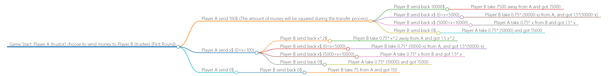

# Yiwei's Problem Set 1
## Project information
- **Author**: Yiwei Liang, Computation and Design with tracks in Computer Science, Class of 2025, Duke Kunshan University
- **Instructor**: Prof. Luyao Zhang, Duke Kunshan University
- **Disclaimer**: Submissions to the Problem Set No.1 or Final Project for [COMPSCI/ECON 206 Computational Microeconomics, 2023 Spring (Seven Week - Second)](https://ce.pubpub.org/) instructed by Prof. Luyao Zhang at Duke Kunshan University.
- **Acknowledgments**: [How to Acknowledge?](https://www.scribbr.co.uk/thesis-dissertation/acknowledgements/)
[notes: please include all professors, students, and staff who have contributed to your completetion of the project.]
- **Project Summary**: 
  - [Summarize the Background/Motivation]
  - [Research Questions]
  - [Application Scenario]
  - [Methodology]
  - [Results]
  - [Intellectual Merits and Practical impacts of your project.]
  
   
Note: please insert the screenshot of the answers to your research question by ChatGPT. The methodology that you use to address the research questions must be more innovative than both the current literature and ChatGPT. 

## Table of Contents

- model
- code
- spotlight
- more about the author
- references

### Model
- **Game Environment**:<br>
    A trust game is a social science experiment involving two participants who do not know each other and are isolated. Assume there are two rational participants who do not know each other. One participant, known as the trustor, is given a sum of money that has 100$ and must decide whether to send some or all of it to the other participant. The amount of money the trustor sends will be squared, and then the trustee can send some or all of the amount back to the trustor. Then the people with less money from those with more can take the amount ranging from zero to three fourth with the condition of difference of their money is bigger than 2$, the transferred money will be timed by a factor of two. This will play two rounds, which is based on two sections. The trustor and the trustee will change their role for the second round. Then accumulate the money for the two rounds to decide who is the winner. In the end, the people with more money at least 5$ compared to the opponent can take the money in his account away, but the people with less money will gain nothing.If they have the same money, they both win what they have.<br>
    The game's goal is to test the trustor's willingness to take a risk and send money to the trustee and the trustee's desire to reciprocate the trust by sending back some of the squared amounts. And then taking back will make the opponents consider the risk of not giving about half the money.<br>
    The game environment is designed to simulate a situation where one must decide whether to trust another person they do not know and cannot communicate with directly. The experiment provides insights into how trust and cooperation operate in various contexts.<br>
**Possible strategies for the trustor**:<br>
"Maximize profit": The trustor can send the maximum amount to the trustee, hoping to receive the most significant return. If the trustee decides to pay less than a fair number, the trustor can take back some of his money and times two.<br>
"Minimize risk": The trustor sends only a small amount of money to the trustee that they got the same amount after the change to minimize the risk of losing money.
"Reciprocity": The trustor sends an amount of money to the trustee that they believe is fair and that the trustee is probably to reciprocate by returning a similar amount.<br>
**Possible strategies for the trustee**:<br>
"Maximize profit": The trustee returns the most significant amount of money to the trustor, then uses the rule of taking money from the people with more money to have more profits.<br>
"Minimize loss": Give precisely the same half amount of money back to the trustor to avoid more losses or the trustor to gain more profits.<br>
"Reciprocity": Consider the money sent by the trustor, and send back a fair amount of money to let them both win.<br>
**Payoffs:**<br>
Considering this situation, the payoff of the trust game divides into these situations.<br>
1. All of the players choose to have the maximum profit strategy. This situation will lead to a maximum overall income, which means the trustor gives all money to the trustee and the trustor reserve all cash, then the trustor takes three-fourths of the difference of their money. The second round will be the same. For this situation, they will all get 15000$+2500$=17500$.<br> 
2. One of the players decides to maximize its profits. If this player is the trustee for the first round, he will work with the trustor to have a 15000$ for the first round. For the second round, he will give 0$ to the trustee, such that the opponent will gain nothing and this guy will have the most money.<br>
3. None of the players decide to work together. They will keep all the money, and after two rounds, they will get 175$.
4. The trustor and the trustee use a certain number of transfers that they think are reasonable. The payoff of this will be between 175$ to 17500$.<br>
- **Solution Concept**:<br>
Based on the backward induction, we will analyze what will happen.<br>
**Second round:**<br>
For the part of taking money away from people with more money, the best choice is to take 3/4 of the difference of their money. Therefore, it is essential to have the chance to take money from whoever has more money after the trustee pays back the money since the gain can be doubled. To win the game, the people with less money have two choices: one is to take a precise amount of money to make them have the same amount, and the other is to take as much as this guy can.<br>
Therefore, the best choice of the trustee is to send all money to the trustor, such that the trustee has the chance to take away the money from the trustor. Or, to avoid the risk of losing, the trustee can take the money away such that the difference between them is lower than 2$, which will cause a win-win situation.<br>
Then for the first step of the second round, the trustor who used to be the trustee in the previous round can send the same number of money to make sure they have a win-win situation, or he can send less money to the trustee, such that the money amount of the trustee can not win the game. <br>
Then we will analyze what the first round will happen.<br>
**First round**:<br>
Considering the taking away progress of the first round, it is the wisest idea to take 3/4 of the differences in money. Or take less to make their difference less than 5$.<br>
Then for the payback progress, to show win the most benefit, the trustee should send all money back, to have the chance of taking away money, but to show fairness and sincerity, the trustee can also make their difference less than 2$.<br>
Considering the giving progress of the first round, the trustor can give all money to a trustee to have a higher total benefit. But if considering the chance of loss due to the second round, the trustor can give nothing to the trustee, such that both of them can win 175$ at the end instead of one of them having nothing.<br>
- **Evaluation**:<br>
**Efficiency**:<br>
This trust game's efficiency can be represented by the total amount of money both players have at the end of the game. In the best efficient situation, the players worked together ultimately, which means they both ended up with 17,500$. This is the best case that the sum of the profits reaches a maximum. However, if players minimize their risk or do not cooperate, they may reach a low amount of money with the lowest 175$ per person, or someone will have nothing.
**Fairness**:<br>
For this trust game, we can call it fair if both players receive approximately the same amount of money. This situation can happen in 2 scenes, in which the trustor and the trustee choose to cooperate or ultimately not work together. This leads to they can gain 175$ to 17500$ per person. However, if the first round played, they worked together very well, but one betrayed the other in the second round, leading to an unfair situation in that one of them will gain much more money than the other. In general, fairness depends on the strategies and personal choices between people, but one more take money away movement will ensure better fairness.<br>
**Risk Management**:<br>
For this trust game, we can find that players must be careful about what to do with the opponent because potential retaliation exists. Therefore, the risk management of the game is also essential.<br>
**Psychological game**:<br>
For this trust game, the trustor and the trustee need to consider the risk and the payoff of sending money to the opponent, which means they have to think about what others will do during the play. Therefore, this contributes to the psychological game between the two players. Such that we need to consider the psychological game for the evaluation.
### Code
- Game Environment:<br>
  Players: There are two players.<br>
  Rounds: The game has two rounds, player have to play different role for each round.<br>
  Endowment: For each round, the trustor will receive 100$ at first, the trustee will have nothing at first.<br>
  Multiplier: The money sent by the trustor will be Squared during the transfer process. And when the money for the take money away process, it will be doubled.<br>
- Strategic plays: The strategic plays mainly divides to maxmize profit, minimize risk, and cooperation.
- Equilibruim Evaluations: e.g. belief, strategy, and payoffs
- <br>
  This is one possiable payoff for 1 round, the other round will be similar to this.<br>
  The customized demo played during class is that the trustor get 1000$ at first, and the transfered money will be times 10. So as the send back process.
  The subjects’ behavior playing the customized demo will be different from this otree demo. Here are some possible differences:<br>
  1. People will perfer to send money back to the other because with the take money away session, they will have a higher payoff if they do this.<br>
  2. People have a higher chance to not collaborate at all because there exists a winner-takes-all rule.
- oTree Experimental Code 


### Spotlight
- **Behavioral experimental paper**:<br>
The paper on behavioral experimental research is "Fairness and Retaliation: The Economics of Reciprocity." by Fehr and Schmidt.<br>
In the article, the authors claim that traditional economic models can not work correctly to explain fairness and social norms by listing data from experiments, which contributes to their conclusion, individuals are willing to pay a cost to punish those who behave unfairly towards them, even when doing so is not in their immediate self-interest (Fehr and Schmidt 1999, 159-160). Therefore, the authors' thoughts show that people prefer revenge on those who do not do fair things to them. At the same time, the authors also mentioned that the influence of economic theories and policies by their discoveries, which is to incorporate reciprocity into consideration, will increase better development. (Fehr and Schmidt 1999, 178-179). This shows that it is considered to consider including exchange when making policies and doing projects.<br>
**What research question does the behavioral experimental research intend to address?**<br>
For this paper, the authors find that individuals would pay costs to punish people who did unfair things to them, even damaging their interests. (Fehr and Schmidt 1999, 160). This shows that the authors do behavioral experimental research to determine what the individuals' reactions' are when facing a different situation and whether the individuals' behavior is completely self-interested during economic processes.<br>
**How does behavior in the experiments differ from backward induction?**<br>
The most significant difference between this behavior in the experiments differ from backward induction is that backward induction maximizes the expectations by giving their beliefs about others' movements. Compared to backward induction, the results of the paper show that individuals are willing to deviate from pure self-interest and punish those who treat them unfairly, even if it comes at a cost.<br>
**What is the behavioral (e.g., psychological, social) foundation that underpins the observed behavior?**<br>
I think the behavioral foundation of the observed behavior is that individuals prefer to react similarly to others. This leads to the result of the paper.<br>

### More about the Author
- headshot
- self-introduction
- Final reflections 
  - intellectual growth
  - professional growth
  - living a purposeful life

### References

- Literature References in [Chicago Author-Date](https://www.chicagomanualofstyle.org/tools_citationguide/citation-guide-2.html) Style and [BibTex](https://scholar.google.com/) 

Fehr, E., & Schmidt, K. M. (1999). Fairness and retaliation: The economics of reciprocity. The Journal of Economic Perspectives, 13(3), 159-181."<br>
Levin, Dan, and Luyao Zhang. 2020. “Bridging Level-K to Nash Equilibrium.” *The Review of Economics and Statistics* 104 (6): 1329–40. https://doi.org/10.1162/rest_a_00990.<br>
```
@article{fehr2000fairness,
  title={Fairness and retaliation: The economics of reciprocity},
  author={Fehr, Ernst and G{\"a}chter, Simon},
  journal={Journal of economic perspectives},
  volume={14},
  number={3},
  pages={159--182},
  year={2000},
  publisher={American Economic Association}
}
```
```
@article{levin2022bridging,
  title={Bridging level-k to nash equilibrium},
  author={Levin, Dan and Zhang, Luyao},
  journal={Review of Economics and Statistics},
  volume={104},
  number={6},
  pages={1329--1340},
  year={2022},
  publisher={MIT Press One Rogers Street, Cambridge, MA 02142-1209, USA journals-info~…}
}
```

